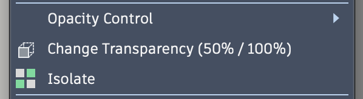

# Toggle Opacity

A small Fusion 360 add-in that adds a **Toggle Opacity (50% / 100%)** item to the
right-click (marking) menu. Click it to flip the selected body/component between
50% and 100% opacity — instead of digging through the native Opacity Control
submenu every time.



## Behavior

- Works on a selected **body**, **occurrence**, or **component** (occurrences have
  no settable opacity, so the component's bodies are flipped), and on multi-selections.
- Toggle rule: if anything in the selection is already translucent, everything goes
  back to 100%; otherwise everything drops to 50%.
- The menu item only appears when the selection has something flippable.

## Install

Copy or symlink this folder into your Fusion AddIns directory:

- **macOS:** `~/Library/Application Support/Autodesk/Autodesk Fusion 360/API/AddIns/`
- **Windows:** `%APPDATA%\Autodesk\Autodesk Fusion 360\API\AddIns\`

```sh
ln -s "$PWD" "$HOME/Library/Application Support/Autodesk/Autodesk Fusion 360/API/AddIns/ToggleOpacity"
```

Then in Fusion: **Utilities → Add-Ins** (or `Shift+S`) → select **ToggleOpacity** → **Run**.
With `runOnStartup` enabled (the default in the manifest) it loads automatically on launch.

## Tip

Assign a keyboard shortcut to the command via Fusion's UI customization to toggle
opacity on the selected body with a single keypress.

## Credits

Built from [FusionAddinTemplate]; bundles [thomasa88lib] (MIT, © 2020 Thomas Axelsson).
The opacity-flip logic mirrors the translucency toggle in the VerticalTimeline add-in.

MIT licensed — see [LICENSE-MIT](LICENSE-MIT).

[FusionAddinTemplate]: https://github.com/
[thomasa88lib]: https://github.com/thomasa88/thomasa88lib
